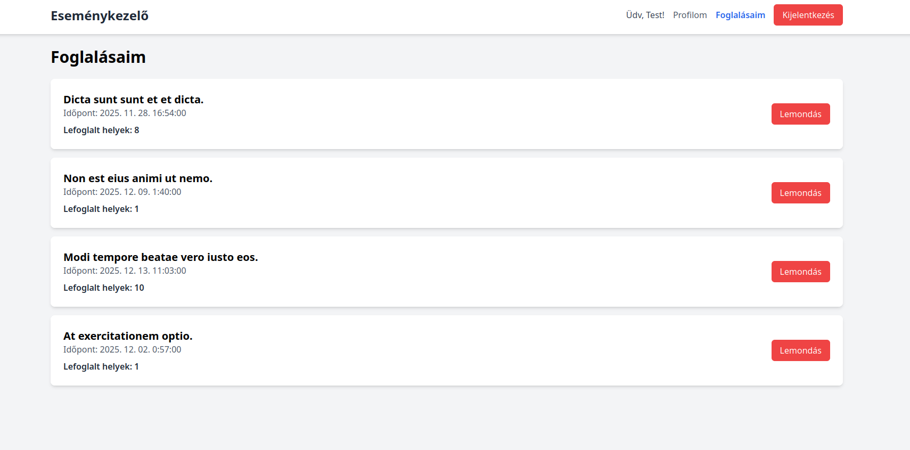

### Főoldal


### Foglalás


### Foglalásaim


# Eseménykezelő és Jegyfoglaló Mini Alkalmazás (Laravel API)

Ez egy egyszerűsített Laravel 12 alkalmazás, amely egy REST API-t biztosít események kezelésére és jegyfoglalásra. A fejlesztői környezet Docker-alapú, a Laravel Sail segítségével futtatható.

## Funkcionális követelmények

- **Autentikáció:** Regisztráció, bejelentkezés API tokenekkel (Sanctum).
- **Események:** Publikus eseménylista és részletek, valamint teljeskörű adminisztrátori CRUD műveletek.
- **Foglalások:** Bejelentkezett felhasználók foglalhatnak helyeket, megtekinthetik és törölhetik saját foglalásaikat. A rendszer ellenőrzi a rendelkezésre álló férőhelyeket.
- **Admin riport:** Eseményenkénti résztvevői lista lekérdezhető.

## Technikai megvalósítás

A projekt a következő szoftververziókkal lett fejlesztve és tesztelve a Laravel Sail (Docker) környezetben.

- **Laravel Framework:** `12.34.0`
- **PHP:** `8.4.13`
- **Adatbázis (MySQL):** `8.0.32`
- **Web Szerver:** Laravel Sail alapértelmezett Nginx image.
- **Composer:** `2.8.12`

A környezet futtatásához szükséges host oldali eszközök:
- **Docker:** `28.5.1`
- **Docker Compose:** `v2.40.0`
---

## Telepítés és Indítás (Docker-rel)

Ez a módszer platformfüggetlen (Windows, macOS, Linux) és nem igényel helyileg telepített PHP-t vagy adatbázis-szervert.

### Előfeltételek
- [Docker](https://www.docker.com/products/docker-desktop/) telepítve és futtatva.

### Lépések

1.  **Projekt klónozása:**
    ```bash
    git clone https://github.com/Rannek/event-booking-kovacs-janos/ esemenykezelo
    cd esemenykezelo
    ```

2.  **Környezeti fájl létrehozása:**
    ```bash
    cp .env.example .env
    ```
**.env**
```
DB_CONNECTION=mysql
DB_HOST=mysql
DB_PORT=3306
DB_DATABASE=esemenykezelo
DB_USERNAME=sail
DB_PASSWORD=password
```

3.  **Docker konténerek indítása:**
    Ez a parancs letölti a szükséges image-eket és elindítja a környezetet a háttérben. Az első indítás több percig is tarthat.

    ```bash
    docker run --rm \
    -u "$(id -u):$(id -g)" \
    -v "$(pwd)":/var/www/html \
    -w /var/www/html \
    laravelsail/php84-composer:latest \
    composer install --ignore-platform-reqs
    ```
    
    ```bash
    ./vendor/bin/sail up -d
    ```
5.  **Alkalmazás kulcs generálása:**
    ```bash
    ./vendor/bin/sail artisan key:generate
    ```

6.  **Adatbázis létrehozása és feltöltése mintaadatokkal:**
    Ez a parancs létrehozza az adatbázis-struktúrát és feltölti a szükséges mintaadatokkal (admin, felhasználó, események).
    ```bash
    ./vendor/bin/sail artisan migrate:fresh --seed
    ```
# Frontend telepítése
```bash
cd frontend
```
```bash
npm install
```
```bash
npm run dev
```
### Az alkalmazás használata

- Az **API** a `http://localhost/api/` címen érhető el.
- Az **adatbázis** egy külső kliensből (pl. DBeaver, TablePlus) a következő adatokkal érhető el:
  - Host: `127.0.0.1`
  - Port: `3306`
  - Adatbázis: `esemenykezelo`
  - Felhasználó: `sail`
  - Jelszó: `password`

### Minta Felhasználók

A `db:seed` parancs az alábbi felhasználókat hozza létre:

- **Admin:**
  - Email: `admin@teszt.hu`
  - Jelszó: `admin123`
- **Felhasználó:**
  - Email: `user@teszt.hu`
  - Jelszó: `user123`

---

## API Végpontok (Teszteléshez)

- `POST /api/regisztracio`: Új felhasználó regisztrálása.
- `POST /api/bejelentkezes`: Bejelentkezés, API token kérése.
- `GET /api/esemenyek`: Publikus eseménylista.

**Védett végpontok (`Authorization: Bearer <token>` szükséges):**
- `POST /api/kijelentkezes`: Kijelentkezés.
- `GET /api/profil`: Bejelentkezett felhasználó adatai.
- `POST /api/esemenyek/{id}/foglalas`: Foglalás egy eseményre.
- `GET /api/sajat-foglalasok`: Saját foglalások listája.

**Admin végpontok (admin jogosultság szükséges):**
- `POST /api/admin/esemenyek`: Új esemény létrehozása.
- `PUT /api/admin/esemenyek/{id}`: Esemény módosítása.
- `DELETE /api/admin/esemenyek/{id}`: Esemény törlése.
- `GET /api/admin/esemenyek/{id}/resztvevok`: Esemény résztvevőinek listája.

## TESZTELÉS

## 1. Felhasználói Műveletek

### 1.1. Új felhasználó regisztrálása

A parancs egy már létező email címmel próbál regisztrálni, bizonyítva, hogy az `unique` email validációs szabály működik.

**Parancs:**
```bash
curl -X POST http://localhost/api/regisztracio \
-H "Content-Type: application/json" \
-H "Accept: application/json" \
-d '{
    "nev": "Kovács János",
    "email": "kovacs.janos@pelda.hu",
    "jelszo": "Jelszo1234",
    "jelszo_confirmation": "Jelszo1234"
}'
```
**Válasz (Sikeres validációs hiba):**
```json
{
    "message": "The email has already been taken.",
    "errors": {
        "email": [
            "The email has already been taken."
        ]
    }
}
```

### 1.2. Bejelentkezés (`user@teszt.hu`)

**Parancs:**
```bash
TOKEN=$(curl -s -X POST http://localhost/api/bejelentkezes \
-H "Content-Type: application/json" \
-H "Accept: application/json" \
-d '{"email": "user@teszt.hu", "jelszo": "user123"}' | jq -r .token)
```
**Eredmény:** A parancs sikeresen lefut, a kapott API token a `TOKEN` környezeti változóba kerül elmentésre a további parancsokhoz.

### 1.3. Profiladatok ellenőrzése (Védett végpont teszt)

**Parancs:**
```bash
curl -X GET http://localhost/api/profil \
-H "Authorization: Bearer $TOKEN" \
-H "Accept: application/json" | jq
```
**Válasz (Sikeres authentikáció):**
```json
{
  "id": 2,
  "nev": "Teszt Felhasználó",
  "email": "user@teszt.hu",
  "email_verified_at": null,
  "szerepkor": "felhasznalo",
  "created_at": "2025-10-21T10:09:51.000000Z",
  "updated_at": "2025-10-21T10:09:51.000000Z"
}
```

### 1.4. Foglalási Ciklus (Létrehozás, Listázás, Törlés)

#### 1. Foglalás létrehozása (1-es eseményre, 2 hellyel)
**Parancs:**
```bash
curl -X POST http://localhost/api/esemenyek/1/foglalas \
-H "Authorization: Bearer $TOKEN" \
-H "Content-Type: application/json" \
-H "Accept: application/json" \
-d '{"helyek_szama": 2}' | jq
```
**Válasz (Sikeres foglalás, ID: 2):**
```json
{
  "data": {
    "foglalas_id": 2,
    "lefoglalt_helyek": 2,
    "foglalas_datuma": "2025-10-21 10:26"
  }
}
```

#### 2. Saját foglalások listázása (foglalás után)
**Parancs:**
```bash
curl -X GET http://localhost/api/sajat-foglalasok \
-H "Authorization: Bearer $TOKEN" \
-H "Accept: application/json" | jq
```
**Válasz (A lista tartalmazza a foglalást, elérhető helyek 199-ről 197-re csökkentek):**
```json
{
  "data": [
    {
      "foglalas_id": 2,
      "lefoglalt_helyek": 2,
      "foglalas_datuma": "2025-10-21 10:26",
      "esemeny": {
        "id": 1,
        "cim": "Ab repellendus commodi facilis maiores quas.",
        "leiras": "Suscipit officia odio cum nobis tempora ducimus est. Quibusdam tempore quis occaecati qui itaque. Facere qui beatae laborum sed aliquid quibusdam tempore. Nisi repellat quasi ipsum facere. Qui quia autem illum tenetur recusandae.",
        "helyszin": "Lake Emmitttown",
        "kezdes": "2025. December 19., 06:43",
        "befejezes": "2025. December 19., 09:43",
        "max_ferohely": 199,
        "elerheto_helyek": 197
      }
    }
  ]
}
```

#### 3. Foglalás törlése (ID: 2)
**Parancs:**
```bash
curl -X DELETE http://localhost/api/foglalasok/2 \
-H "Authorization: Bearer $TOKEN" \
-H "Accept: application/json"
```
**Válasz:** Üres válasz (HTTP 204 No Content).

#### 4. Törlés ellenőrzése
**Parancs:**
```bash
curl -X GET http://localhost/api/sajat-foglalasok \
-H "Authorization: Bearer $TOKEN" \
-H "Accept: application/json" | jq
```
**Válasz (A lista most már üres):**
```json
{
  "data": []
}
```

---

## 2. Adminisztrátori Műveletek

### 2.1. Admin bejelentkezés

**Parancs:**
```bash
ADMIN_TOKEN=$(curl -s -X POST http://localhost/api/bejelentkezes \
-H "Content-Type: application/json" -d '{"email": "admin@teszt.hu", "jelszo": "admin123"}' | jq -r .token)
```
**Eredmény:** Az `ADMIN_TOKEN` változó beállítva a kapott adminisztrátori API tokenre.

### 2.2. Esemény CRUD (Létrehozás, Módosítás, Törlés)

#### 1. Új esemény létrehozása
**Parancs:**
```bash
curl -X POST http://localhost/api/admin/esemenyek \
-H "Authorization: Bearer $ADMIN_TOKEN" \
-H "Content-Type: application/json" \
-H "Accept: application/json" \
-d '{
    "cim": "Arch Linux Találkozó 2026",
    "leiras": "Ismerkedés, előadások és workshopok.",
    "helyszin": "Budapest",
    "kezdes": "2026-09-20 10:00:00",
    "befejezes": "2026-09-20 18:00:00",
    "max_ferohely": 100
}' | jq
```
**Válasz (Sikeres létrehozás, ID: 16):**
```json
{
  "data": {
    "id": 16,
    "cim": "Arch Linux Találkozó 2026",
    "leiras": "Ismerkedés, előadások és workshopok.",
    "helyszin": "Budapest",
    "kezdes": "2026. September 20., 10:00",
    "befejezes": "2026. September 20., 18:00",
    "max_ferohely": 100,
    "elerheto_helyek": 100
  }
}
```

#### 2. Esemény módosítása (ID: 16)
**Parancs:**
```bash
curl -X PUT http://localhost/api/admin/esemenyek/16 \
-H "Authorization: Bearer $ADMIN_TOKEN" \
-H "Content-Type: application/json" \
-H "Accept: application/json" \
-d '{
    "cim": "Arch Linux Találkozó 2026 (Módosítva)",
    "leiras": "Ismerkedés, előadások és workshopok.",
    "helyszin": "Debrecen",
    "kezdes": "2026-09-21 10:00:00",
    "befejezes": "2026-09-21 18:00:00",
    "max_ferohely": 150
}' | jq
```
**Válasz (Sikeres módosítás):**
```json
{
  "data": {
    "id": 16,
    "cim": "Arch Linux Találkozó 2026 (Módosítva)",
    "leiras": "Ismerkedés, előadások és workshopok.",
    "helyszin": "Debrecen",
    "kezdes": "2026. September 21., 10:00",
    "befejezes": "2026. September 21., 18:00",
    "max_ferohely": 150,
    "elerheto_helyek": 150
  }
}
```

#### 3. Esemény törlése (ID: 16)
**Parancs:**
```bash
curl -X DELETE http://localhost/api/admin/esemenyek/16 \
-H "Authorization: Bearer $ADMIN_TOKEN" \
-H "Accept: application/json"
```
**Válasz:** Üres válasz (HTTP 204 No Content).

### 2.3. Riport lekérése

**Parancs:**
```bash
curl -X GET http://localhost/api/admin/esemenyek/1/resztvevok \
-H "Authorization: Bearer $ADMIN_TOKEN" \
-H "Accept: application/json" | jq
```
**Válasz (Helyesen üres lista, mivel az 1-es eseményen nincs foglalás):**
```json
[]
```
